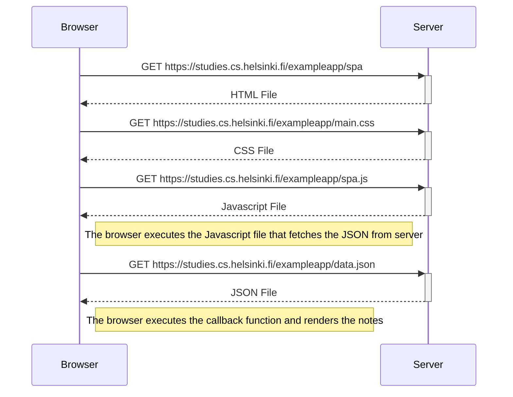

```mermaid
sequenceDiagram
participant B as Browser
participant S as Server

B->>+S: GET https://studies.cs.helsinki.fi/exampleapp/spa
S-->>-B: HTML File

B->>+S: GET https://studies.cs.helsinki.fi/exampleapp/main.css
S-->>-B: CSS File

B->>+S: GET https://studies.cs.helsinki.fi/exampleapp/spa.js
S-->>-B: Javascript File

Note right of B: The browser executes the Javascript file that fetches the JSON from server

B->>+S: GET https://studies.cs.helsinki.fi/exampleapp/data.json
S-->>-B: JSON File

Note right of B: The browser executes the callback function and renders the notes
```