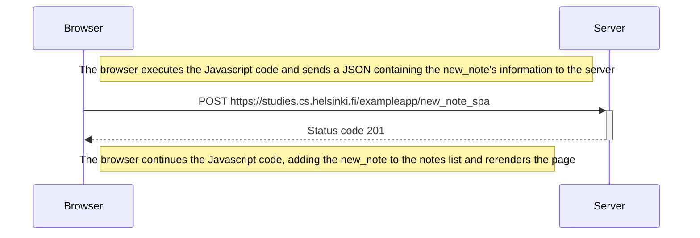

```mermaid
sequenceDiagram
participant B as Browser
participant S as Server

Note right of B: The browser executes the Javascript code and sends a JSON containing the new_note's information to the server
B->>+S: POST https://studies.cs.helsinki.fi/exampleapp/new_note_spa
S-->>-B: Status code 201
Note right of B: The browser continues the Javascript code, adding the new_note to the notes list and rerenders the page
```